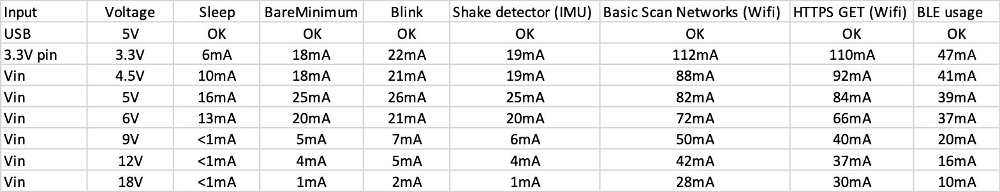
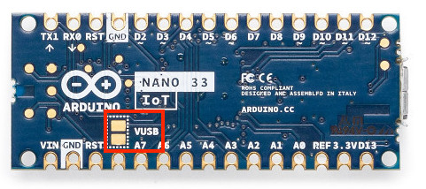
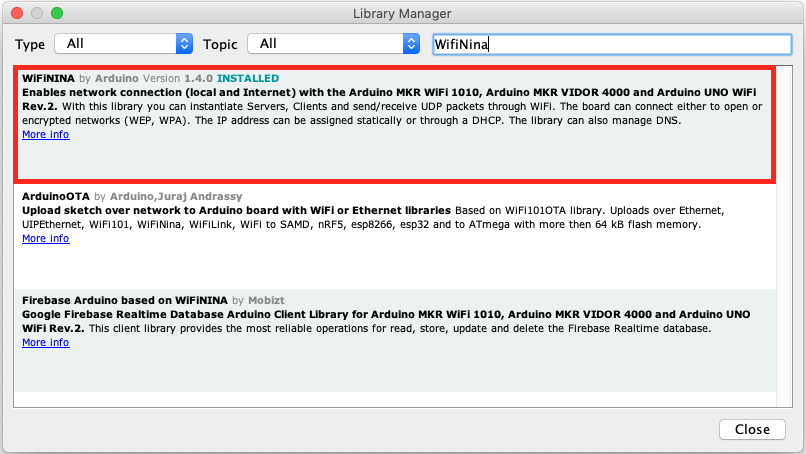
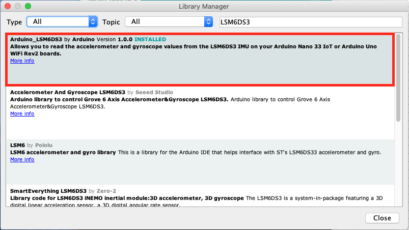
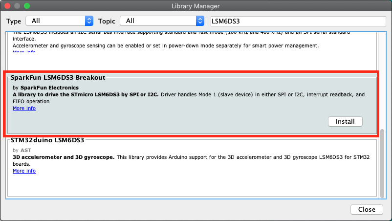
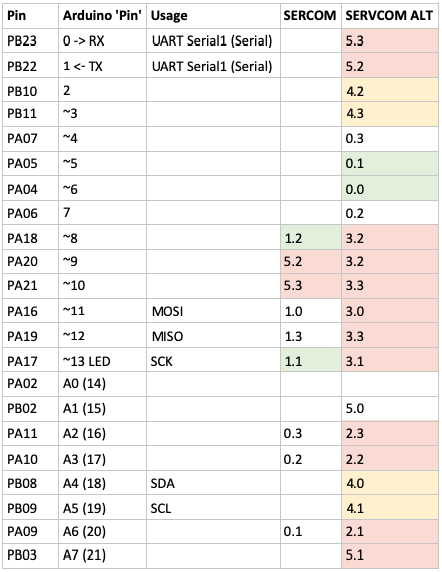

# Arduino Nano 33 IoT - Ultimate Guide
The purpose of this guide is to assemble the key information to use the Arduino Nano 33 IoT in your projects. At the writing of this guide, the Arduino Nano 33 IoT is quite new on the market and there was not plenty of information available on the internet.

I wrote this guide because I was a bit frustrated by the lack of information on the board and most of the insight here is coming from experiments. Some information is also coming from other websites, if it is the case, the resources are mentioned in the sections.

## Important things to remember
The [official quick start guide](https://www.arduino.cc/en/Guide/NANO33IoT) is available on the Arduino website.

The Arduino Nano 33 IoT **only supports 3.3V** for inputs and outputs (IO pins) and it is not 5V tolerant like most of the other Arduino boards. Connecting more than 3.3V on IO pins will damage the board.

The pinouts is **compatible with the classic Arduino Nano pinouts**. Notice that the classic 5V pin is not wired by default and doesn't provide any power if you don't connect the VUSB jumper.

The pins A4 and A5 have an internal pull up and are designed to be used as an I2C bus. So, **usage of A4 and A5 as analog inputs is not recommended**.

## Unofficial Arduino Nano 33 IoT pinout diagram


Useful ressources:
*  [Unofficial Arduino Nano 33 IoT pinout diagram (PDF)](https://github.com/ostaquet/Arduino-Nano-33-IoT-Ultimate-Guide/raw/master/resources/Arduino%20Nano%2033%20IoT%20pinout%20diagram.pdf)
*  [Official pinout diagram (PDF)](https://content.arduino.cc/assets/Pinout-NANO33IoT_latest.pdf)
*  [Official datasheet of Atmel SAMD21G](https://cdn.sparkfun.com/datasheets/Dev/Arduino/Boards/Atmel-42181-SAM-D21_Datasheet.pdf)

## Which pins can be used for external interrupt?
The pins below can be used with `attachInterrupt()` on Nano 33 IoT.

| Board PIN | Internal PIN |
|----|----|
| A1  | 15 |
| A5  | 19 |
| A7  | 21 |
| D2  |  2 |
| D3  |  3 |
| D9  |  9 |
| D10 | 10 |
| D11 | 11 |

That information was extracted from [github.com/arduino/ArduinoCore-samd/blob/master/variants/nano_33_iot/variant.cpp](https://github.com/arduino/ArduinoCore-samd/blob/master/variants/nano_33_iot/variant.cpp).

*Originally shared by [@mfreema5](https://github.com/mfreema5) in [issue #1](https://github.com/ostaquet/Arduino-Nano-33-IoT-Ultimate-Guide/issues/1).*

## How to power the Arduino Nano 33 IoT?
According to the box, the Arduino Nano 33 IoT can be powered by the USB connector (5V) or through the Vin pin (4.5V - 21V) while its operating voltage is 3.3V. However, it seems that the supply voltage depends on the usage. There is a [discussion on the Arduino forum about this topic](https://forum.arduino.cc/index.php?topic=624569.0).

See the results of the experiments below regarding the power supply and the peak current consumption per voltage.



The programs below have been used to test the power consumption of the embedded modules:
*  **Sleep**: Using the watchdog to set the board to idle (see section *How to save power?* below)
*  **BareMinimum**: Just do nothing, included in Built-in Examples of Arduino IDE.
*  **Blink**: Blink the internal LED, included in Built-in Examples of Arduino IDE.
*  **IMU_ShakeDetector**: Use the IMU to detect acceleration and light on the internal LED ([source code](https://github.com/ostaquet/arduino-nano-33-iot-ultimate-guide/blob/master/src/IMU_ShakeDetector/IMU_ShakeDetector.ino))
*  **Wifi_BasicScanNetworks**: Use the Wifi to scan networks and light on the internal LED if there are networks available ([source code](https://github.com/ostaquet/arduino-nano-33-iot-ultimate-guide/blob/master/src/Wifi_BasicScanNetworks/Wifi_BasicScanNetworks.ino))
*  **Wifi_HTTPS_GET**: Use the Wifi to get the www.google.com page with SSL enabled and light on the internal LED if everything goes fine ([source code](https://github.com/ostaquet/arduino-nano-33-iot-ultimate-guide/blob/master/src/Wifi_HTTPS_GET/Wifi_HTTPS_GET.ino))

## How to enable the 5V pin on the Arduino Nano 33 IoT?
The Arduino Nano 33 IoT has a 5V pin which is not wired by default. If you need 5V for your project and you supply power through USB, you can connect the VUSB jumper to enable 5V power supply on the VUSB pin.

To to that, you just have to solder the VUSB jumper on the board.



Notice that you cannot supply power to the board through this pin, it is only to have a handy 5V for your external components powered by the USB. If you don't power the board through the USB jack, you will stay with 0V on this pin.

## How to save power with the Arduino Nano 33 IoT?
There are the recommended approaches to save power with the Arduino Nano 33 IoT:

- Shutdown all useless components (Wifi, IMU...) and put the microcontroller (SAMD21G) in sleep mode. This will allow you to go down to 6mA while sleeping (if powered in 3.3V). [See how to put the Arduino Nano 33 IoT on sleep](SavePowerSleeping.md).
- Shutdown the power and wake-up based on a RTC clock. This will allow you to go down to 0mA while the power is off and wake up at a specific interval of time (every minutes, every hours...). [See how to shutdown the power of the Arduino Nano 33 IoT and wake up on specific time with the RTC](SavePowerRTC.md).

## How to use the Wifi with the Arduino Nano 33 IoT?
The Wifi module embedded on the Arduino Nano 33 IoT is the popular [NINA W102](https://www.u-blox.com/sites/default/files/NINA-W10_DataSheet_%28UBX-17065507%29.pdf) ESP32 based module. It provides support of Wifi 802.11 b/g/n in the 2.4 GHz band and Bluetooth v4.2 (Bluetooth BR/EDR and Bluetooth Low Energy BLE). The module is fully compatible with the [official WiFiNINA library](https://www.arduino.cc/en/Reference/WiFiNINA).

To install the official library in the Arduino IDE, go in the menu *Tools -> Manage Libraries...* In the library manager, search for `WifiNINA` and install the `WiFiNINA` by `Arduino`.



Useful ressources:
*  [Official documentation of the WiFiNINA library](https://www.arduino.cc/en/Reference/WiFiNINA)
*  [Datasheet of the NINA W102](https://www.u-blox.com/sites/default/files/NINA-W10_DataSheet_%28UBX-17065507%29.pdf)

## How to use the Inertial Measurement Unit (IMU) with the Arduino Nano 33 IoT?
The IMU embedded in the Arduino Nano 33 IoT is the [LSM6DS3](https://www.st.com/resource/en/datasheet/lsm6ds3.pdf). It is composed by a 3-axis accelerometer and a 3-axis gyroscope. The LSM6DS3 on the Arduino Nano 33 IoT can be use easily through the I2C bus on the slave address 0x6A.

There are two handy libraries to use the IMU:
*  The [official Arduino LSM6DS3 library](https://github.com/arduino-libraries/Arduino_LSM6DS3) (for basic features)
*  The [Sparkfun LSM6DS3 library(https://github.com/sparkfun/SparkFun_LSM6DS3_Arduino_Library) (for advanced features)

Useful ressources:
*  [Datasheet of the ST LSM6DS3](https://www.st.com/resource/en/datasheet/lsm6ds3.pdf)

### The official Arduino LSM6DS3 library (basic usage)
To install the official library in the Arduino IDE, go in the menu *Tools -> Manage Libraries...* In the library manager, search for `LSM6DS3` and install the `Arduino_LSM6DS3` by `Arduino`.



The usage is described on the [official Arduino website](https://www.arduino.cc/en/Reference/ArduinoLSM6DS3).

Simple programs are available with the library:
*  [Simple accelerometer](https://github.com/arduino-libraries/Arduino_LSM6DS3/blob/master/examples/SimpleAccelerometer/SimpleAccelerometer.ino)
*  [Simple gyroscope](https://github.com/arduino-libraries/Arduino_LSM6DS3/blob/master/examples/SimpleGyroscope/SimpleGyroscope.ino)

### The Sparkfun LSM6DS3 library (advanced usage)
To install the official library in the Arduino IDE, go in the menu *Tools -> Manage Libraries...* In the library manager, search for `LSM6DS3` and install the `SparkFun LSM6DS3 Breakout` by `SparkFun Electronics`.



The usage is described on the [GitHub page of the library](https://github.com/sparkfun/SparkFun_LSM6DS3_Arduino_Library). You will notice that this library is offering advanced features like:
*  Usage through multiples instances on I2C channels and SPI.
*  Additional driver with math functions to convert raw values to meaningful data.
*  Usage of built-in buffer to burst-collect data

When you are using this library, don't forget to change the I2C address to 0x6A (by default, the SparkFun module address is 0x6B). The change in the [minimalist example](https://github.com/sparkfun/SparkFun_LSM6DS3_Arduino_Library/blob/master/examples/MinimalistExample/MinimalistExample.ino) is in the initialization of the driver. 

The line :
```LSM6DS3 myIMU;```

Has to be changed with:
```LSM6DS3 myIMU(I2C_MODE, 0x6A);```

## How to use serial communication? (Why there is no SoftwareSerial.h in the Arduino Nano 33 IoT?)

There is no `SoftwareSerial.h` available for the Arduino Nano 33 IoT because it is not required. This board offers much more: Hardware serials that can be assigned to different pins.

This feature is offered by the micro controller Atmel SAMD21G and it is called I/O multiplexing (details available page 21 in the [data sheet Atmel SAM D21E / SAM D21G / SAM D21J](https://cdn.sparkfun.com/datasheets/Dev/Arduino/Boards/Atmel-42181-SAM-D21_Datasheet.pdf)). The micro controller is offering 6 SERCOM that you can assign to (nearly) any pins.

Some of the SERCOM are already used by the Arduino Nano 33 IoT:
*  SERCOM2 for SPI NINA
*  SERCOM3 for MOSI/MISO
*  SERCOM4 for I2C bus
*  SERCOM5 for Serial debugging (USB)

We still have the SERCOM0 and SERCOM1.

The details of the pins assignments are described in the `variant.cpp` and `variant.h` files. As Arduino is open-source, you can easily find them on [the GitHub repository for SAMD boards](https://github.com/arduino/ArduinoCore-samd).

For the Arduino Nano 33 IoT, the pins assignments are described in:
*  [variants/nano_33_iot/variant.cpp](https://github.com/arduino/ArduinoCore-samd/blob/master/variants/nano_33_iot/variant.cpp)
*  [variants/nano_33_iot/variant.h](https://github.com/arduino/ArduinoCore-samd/blob/master/variants/nano_33_iot/variant.h)

By reading the `variant.cpp`, we understand the pin assignment and especially the link between the SAMD pin (PAxx or PBxx) and the Arduino pin.

The SAMD pins are important to make the link with the PORT Function Multiplexing of [the data sheet Atmel SAM D21E / SAM D21G / SAM D21J](https://cdn.sparkfun.com/datasheets/Dev/Arduino/Boards/Atmel-42181-SAM-D21_Datasheet.pdf).

A SERCOM can be *classic* or *alternate*. In the data sheet, the *classic* is in the column C and the *alternate* is in the column D. A SERCOM is defined by its index and the pad. For example: `SERCOM0/PAD[3]` is also called `0.3`.

**Remark:** The pads are defined from 0 to 3 for the RX but the TX is defined only on 0 and 2. It is an important consideration when you choose the pins to use.

For reference, see below the table I used to select the SERCOM to assign:



Enough of theory, go for the solution...

Add a **hardware serial on pins 5 (RX) and 6 (TX)** of the Arduino Nano 33 IoT:
```c++
#include <Arduino.h>
#include "wiring_private.h"

Uart mySerial (&sercom0, 5, 6, SERCOM_RX_PAD_1, UART_TX_PAD_0);

// Attach the interrupt handler to the SERCOM
void SERCOM0_Handler()
{
    mySerial.IrqHandler();
}

void setup() {
  // Reassign pins 5 and 6 to SERCOM alt
  pinPeripheral(5, PIO_SERCOM_ALT);
  pinPeripheral(6, PIO_SERCOM_ALT);

  // Start my new hardware serial
  mySerial.begin(9600);
}

void loop() {
  // Do something with mySerial...
}
```

Another example, add a **hardware serial on pins 13 (RX) and 8 (TX)** of the Arduino Nano 33 IoT:

```c++
#include <Arduino.h>
#include "wiring_private.h"

Uart mySerial (&sercom1, 13, 8, SERCOM_RX_PAD_1, UART_TX_PAD_2);

// Attach the interrupt handler to the SERCOM
void SERCOM1_Handler()
{
    mySerial.IrqHandler();
}

void setup() {
  // Reassign pins 13 and 8 to SERCOM (not alt this time)
  pinPeripheral(13, PIO_SERCOM);
  pinPeripheral(8, PIO_SERCOM);

  // Start my new hardware serial
  mySerial.begin(9600);
}

void loop() {
  // Do something with mySerial...
}
```

