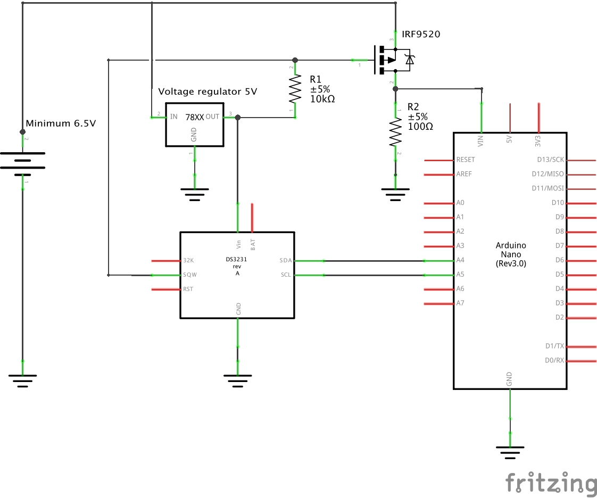
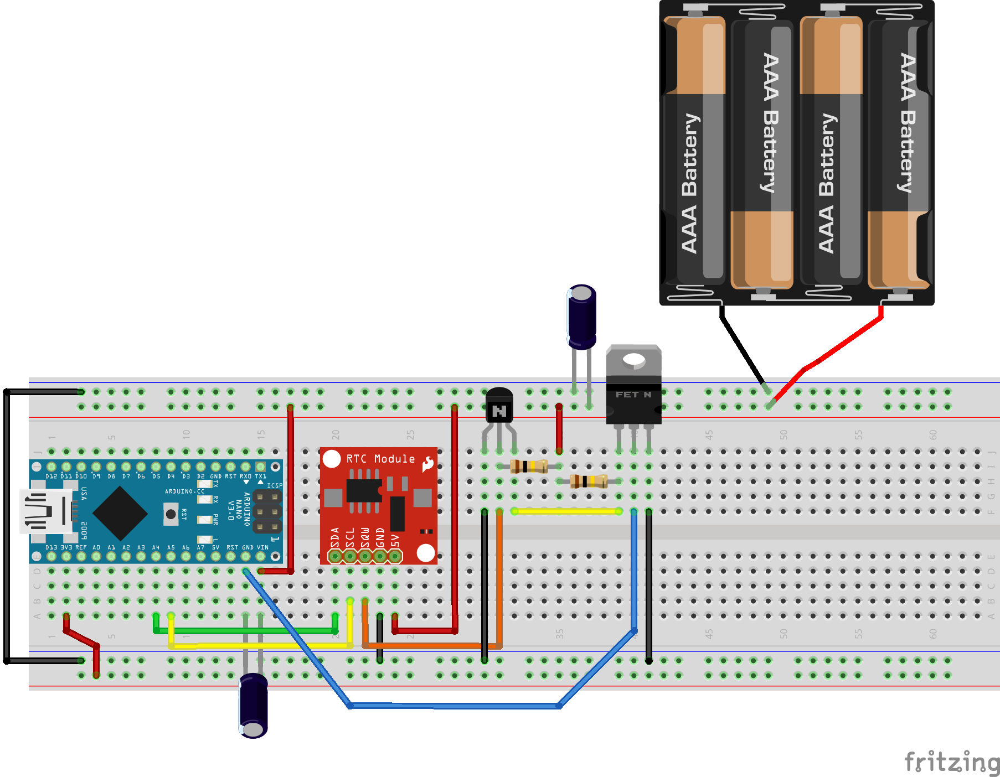

# How to save power with the Arduino Nano 33 IoT by shutting down the power and wake up on RTC alarm?

## How to shut down the power of the Arduino Nano 33 IoT and wake up on a specific time with the RTC clock?

In most data capture projects, the microcontroller is spending a tremendous amount of time doing nothing (waiting or sleeping). During this sleeping time, the power is consumed and the batteries are going down. In order to keep your project alive on months/years on the battery, the best is to minimize the power consumption while the sleeping cycle.

The approach described here allows to:

- Shutdown all the power of the circuit during the sleep cycle.
- Wake up at pre-defined intervals (every minute, every hour, every day or at a specific moment).
- Consume only the power required for the RTC clock.

What do you need?

- RTC DS3231 module (I use the ChronoDot 2.1 by Macetech but any DS3231 module with the INT pin wired in OK)
- The [library DS3231 by NothernWidget](https://github.com/NorthernWidget/DS3231)
- 2x capacitors 0.1mF
- 2x resistors 100KOhms
- 1x NPN transistor (I use the BC547B)
- 1x MOSFET N-channel (I use the STP16NF06)

The schematics is quite simple:



If you want to reproduce this circuit on a breadboard:



The bevavior is easy to understand:

- The Arduino Nano 33 IoT is piloting the RTC clock via I2C bus to set the alarm and clear the alarm.
- The alarm of RTC clock is piloting the NPN transistor to open the power on the MOSFET.
- The Arduino Nano 33 IoT is powered through the MOSFET.
- The program is running only once and go every time through the `setup()` and `loop()` functions.

The program below is doing:

- Blink the built-in LED 3 times fast at the startup.
- Set the alarm on the RTC to wake up every minute.
- Blink the built-in LED for 5 seconds.
- Clear the alarm to shut down the power.

```c++
// Libraries required
#include <Wire.h>
#include <DS3231.h>

// Global variables
DS3231 Clock;

void setup() {
  // Wait 1 second (sometime, the wake-up is hard...)
  delay(1000);
  
  // Initialize LED
  pinMode(PIN_LED, OUTPUT);

  // On startup, blink 3 times fast...
  for(uint8_t i = 0; i < 3; i++) {
    digitalWrite(PIN_LED, HIGH);
    delay(100);
    digitalWrite(PIN_LED, LOW);
    delay(100);
  }

  // Start the I2C interface
  Wire.begin();

  // Alarm is not enabled! Should set alarm
  if(!Clock.checkAlarmEnabled(1))
  {
    Clock.setClockMode(false);
    // 0b1111 // each second
    // 0b1110 // Once per minute (when second matches)
    // 0b1100 // Once per hour (when minute and second matches)
    // 0b1000 // Once per day (when hour, minute and second matches)
    // 0b0000 // Once per month when date, hour, minute and second matches. Once per week if day of the week and A1Dy=true
    // Set alarm to happen every minute (change to your wanted interval)
    Clock.setA1Time(1, 1, 1, 0, 0b1110, false, false, false);
    Clock.turnOnAlarm(1);
  }

  // Empty the I2C buffer
  while(Wire.available()) {
    Wire.read();
  }
}

/****************************************************************************************
 * Main program
 ***************************************************************************************/
void loop() {
  // When waking-up, blink for 5 seconds
  for(uint8_t i = 0; i < 5; i++) {
    digitalWrite(PIN_LED, HIGH);
    delay(1000);
    digitalWrite(PIN_LED, LOW);
    delay(1000);
  }
  
  // Reset alarm to turn off the device
  Clock.checkIfAlarm(1);

  // Wait 10 seconds (if power down not wired)
  delay(10000);
}
```

([See the source code](https://github.com/ostaquet/arduino-nano-33-iot-ultimate-guide/blob/master/src/PowerOnTimer/PowerOnTimer.ino))