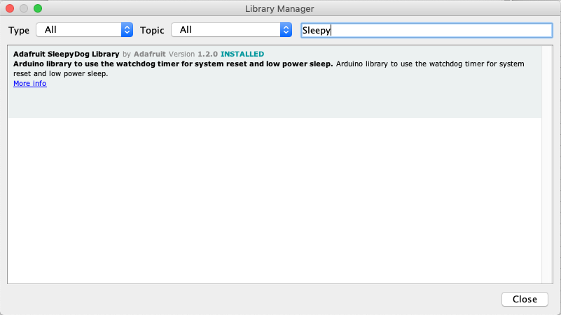

# How to save power with the Arduino Nano 33 IoT by sleeping?

## How to put the Arduino Nano 33 IoT on sleep?

The common way to save power with microcontroller is to go to sleep and use the watchdog to wakeup. Indeed, most of the power are drain while the microcontroller is doing nothing (i.e. waiting between two sample). This will allow you to go down to 6mA at the microcontroller level while sleeping (if powered in 3.3V).

The very popular [Low-Power library](https://github.com/rocketscream/Low-Power) is supporting the SAMD21G but only after making some patching. A good alternative is to use the [Adafruit SleepyDog Library](https://github.com/adafruit/Adafruit_SleepyDog).

To install the library in the Arduino IDE, go in the menu *Tools -> Manage Libraries...* In the library manager, search for `Sleepy` and install the `Adafruit SleepyDog Library` by `Adafruit`.



The usage is quite simple:

```c++
#include <Adafruit_SleepyDog.h>

void setup() {
  pinMode(LED_BUILTIN, OUTPUT);
  digitalWrite(LED_BUILTIN, HIGH);
  delay(16000);
}

void loop() {
  digitalWrite(LED_BUILTIN, LOW); // Show we're sleeping
  
  // Sleep
  Watchdog.sleep();

  digitalWrite(LED_BUILTIN, HIGH); // Show we're awake again
  delay(5000);
}
```

When you're calling the function `Watchdog.sleep()`, the board will be idle for **16 seconds** and the consumption is going as low as **6mA when powered at 3.3V** (which is quite better than 18mA with the BareMinimum program).

The function `Watchdog.sleep()` sets the MCU in `STANDBY` mode. According to the [datasheet of the SAMD21](https://microchipdeveloper.com/32arm:samd21-pm-overview), the `STANDBY` mode is the lowest power consumption mode available on a SAMD21 MCU. In `STANDBY` mode, all system clocks are disabled and the voltage regulators are set to run in low power mode.

The only trick is when you want to upload a new program on your board... When the board is idle, you cannot upload a new program on it because it is not listening to the USB serial. So, never upload a program without some activities (real activities or fake activities like the `delay(5000)` above) to have the time slot to upload successfully.

Useful resources:

*  [Adafruit SleepyDog Library](https://github.com/adafruit/Adafruit_SleepyDog)
